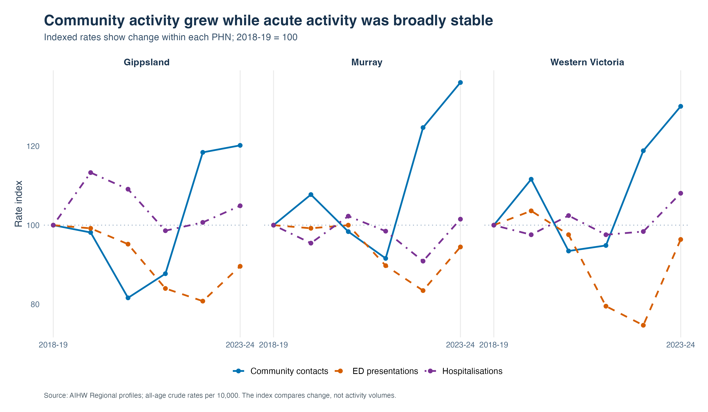
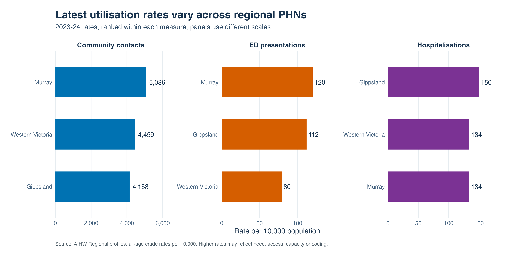
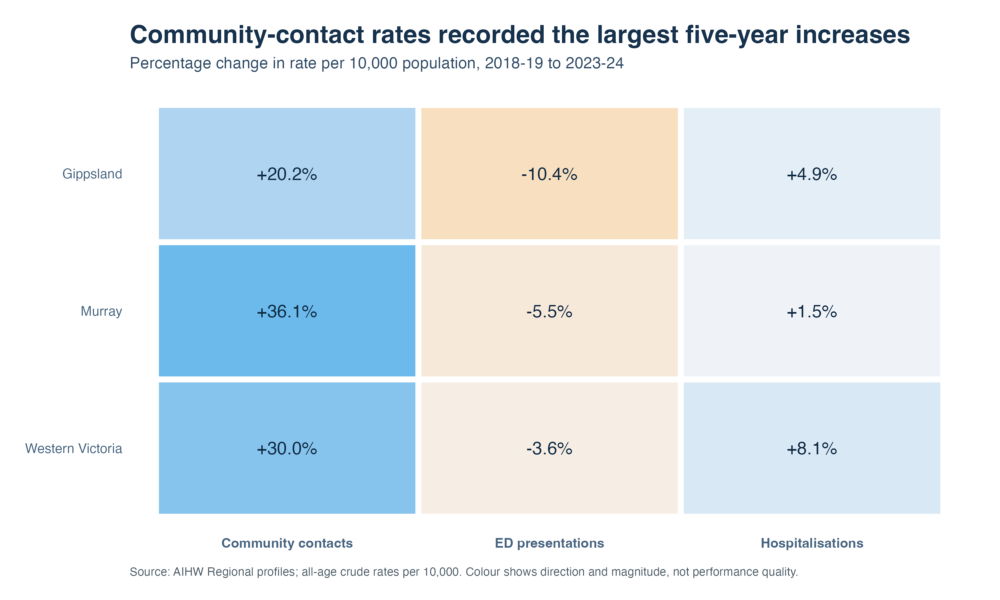
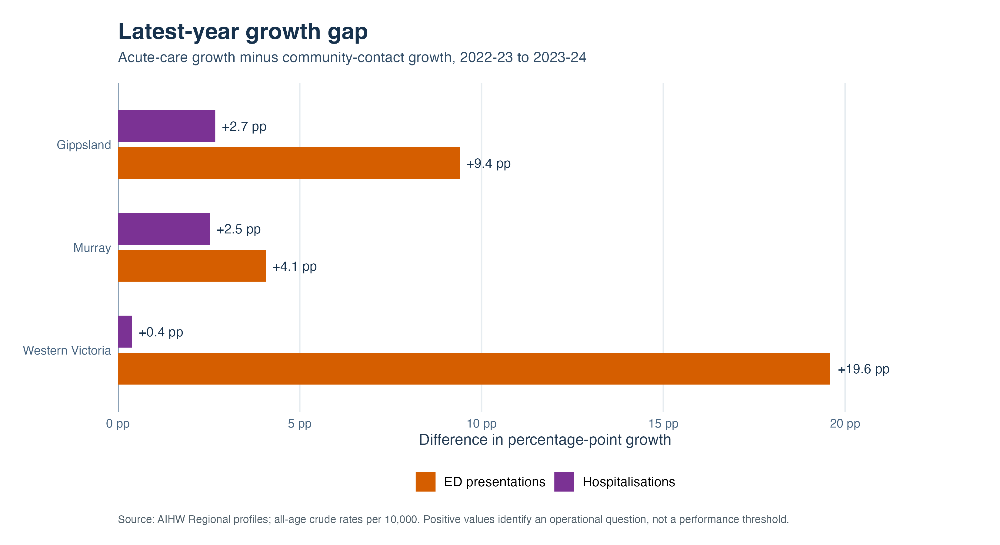

# Victorian regional mental-health service utilisation

## Executive Summary

This briefing examines how population-based mental-health service utilisation changed across the Gippsland, Murray and Western Victoria Primary Health Networks (PHNs) from 2018–19 to 2023–24. It uses Australian Institute of Health and Welfare (AIHW) all-age rates for community mental-health contacts, emergency department (ED) presentations and hospitalisations.

### Key findings

- **Community-contact rates increased in all three PHNs.** The largest increase was in Murray (+36.1%), followed by Western Victoria (+30.0%) and Gippsland (+20.2%).
- **Acute-care rates were comparatively stable over five years.** ED presentation rates were lower in 2023–24 than in 2018–19 in every PHN. Hospitalisation rates increased by between 1.5% and 8.1%.
- **The latest year differs from the five-year pattern.** From 2022–23 to 2023–24, ED and hospitalisation rates grew faster than community contacts in every PHN. Western Victoria recorded the largest ED growth gap: 29.0% ED growth compared with 9.5% community-contact growth, a difference of 19.6 percentage points.
- **The regional range widened for community contacts.** The difference between the highest and lowest PHN rates increased from 309 to 933 contacts per 10,000. The equivalent ranges narrowed slightly for ED presentations and hospitalisations.
- **Latest rates show different regional profiles.** In 2023–24, Murray recorded the highest community-contact and ED presentation rates, while Gippsland recorded the highest hospitalisation rate. A higher rate does not by itself indicate better or poorer performance.

### Why this matters

The longer-term trend is consistent with substantial growth in specialised community activity across regional Victoria. The latest-year increase in acute activity warrants monitoring because it differs from the broader five-year pattern. The available data cannot explain why this occurred or determine whether community services prevented acute presentations. Operational evidence is needed before drawing conclusions about service performance.

### Questions for operational review

- Did demand, case complexity or clinical acuity change between 2022–23 and 2023–24?
- Were there changes in community access, waiting times, service capacity, opening hours or referral pathways?
- Did hospital or community-service coding, coverage or reporting practices change?
- Are the trends concentrated in particular age groups, local areas, service providers or diagnostic groups?
- Do patient-flow and outcome data show repeated ED use, readmissions or gaps following discharge?

## Business question

**How has mental-health service utilisation changed across regional Victorian PHNs, and which patterns warrant further operational review?**

The analysis is designed for performance reporting and monitoring. It describes changes in utilisation and identifies questions for further investigation; it does not assess causation, service quality or whether activity met population need.

## Data

Source: [AIHW Regional profiles of mental health service activity](https://www.aihw.gov.au/mental-health/monitoring/regional-profiles), dashboard exports retrieved 27 September 2026.

The analysis covers three regional Victorian PHNs and six financial years, from 2018–19 to 2023–24. It uses published all-age crude rates per 10,000 population for:

- specialised community mental-health contacts;
- mental-health-related ED presentations; and
- mental-health-related hospitalisations.

Geography is based on the patient's usual residence. AIHW maps all years to consistent 2023 PHN boundaries. The original dashboard exports are retained in `data/raw/`, allowing the cleaning and validation steps to be rerun without downloading data again.

## Methods

The R workflow:

1. reads the UTF-16 AIHW dashboard exports and identifies the embedded data table;
2. selects published all-age PHN rates for the three service indicators;
3. validates the expected 3-region × 3-indicator × 6-year panel, unique keys and numeric values;
4. calculates annual and five-year percentage changes;
5. indexes each series to 2018–19 to compare the direction and scale of change across indicators;
6. compares the highest and lowest regional rates to assess whether the regional range widened or narrowed; and
7. compares latest-year acute-care growth with community-contact growth as an operational review prompt.

No modelling or significance testing is used. The purpose is transparent descriptive analysis that can be explained and checked easily.

## Key findings

### 1. How has the service mix changed?

Community-contact rates increased more than ED presentation or hospitalisation rates in each PHN over the full period. Indexing makes the direction and relative scale of change comparable; it does not compare activity volumes.



### 2. Which PHNs recorded the highest latest rates?

The latest rates describe different service-utilisation profiles. Murray recorded the highest community-contact rate (5,086 per 10,000) and ED presentation rate (120). Gippsland recorded the highest hospitalisation rate (150).



### 3. Which indicators changed most over five years?

Community-contact rates recorded the largest percentage increases. Murray had the largest community-contact change (+36.1%), Gippsland the largest ED change (a 10.4% decrease), and Western Victoria the largest hospitalisation change (+8.1%).



### 4. Which latest-year observations warrant operational review?

Both acute indicators grew faster than community contacts in every PHN between 2022–23 and 2023–24. The most pronounced difference was ED growth in Western Victoria. These differences identify questions for review; they are not performance thresholds or evidence that changes in community care caused acute activity.



The supporting management tables are in `results/`, including the largest change by indicator, regional-range comparison and operational review prompts.

## Operational implications

- **Prioritise monitoring of the latest-year change.** Check whether the acute-care increase continues in newer monthly or quarterly data before treating it as an established trend.
- **Start with Western Victoria's ED pattern.** Its ED rate remained the lowest of the three PHNs in 2023–24, but its latest annual increase was the largest. Review the change in context rather than relying on either the level or growth rate alone.
- **Review Gippsland's hospitalisation profile.** Gippsland had the highest 2023–24 hospitalisation rate and relatively slow community-contact growth in the latest year.
- **Investigate the widening community-contact range.** Determine whether the difference reflects population need, local service models, capacity, data coverage or reporting practice.
- **Triangulate before action.** Add access, workforce, waiting-time, patient-flow, readmission, outcome and demographic data to assess whether an operational response is required.

## Limitations

- This is descriptive service-utilisation analysis. It does not measure prevalence, unmet need, effectiveness, quality or outcomes.
- Rates are crude rather than age-standardised. Differences in population structure may affect comparisons.
- Community contacts are encounters, not unique patients. A person can have multiple contacts, ED presentations or hospitalisations.
- The three indicators come from different care settings and collections. They cannot be combined into a single measure of demand or used to infer patient transitions.
- Utilisation may reflect need, access, capacity, referral pathways, service models, coding and data coverage.
- COVID-19 and associated population changes complicate comparisons across the period.
- AIHW rounds activity values and may suppress detailed data for confidentiality and reliability. All 54 all-age observations used here were published.
- Percentage changes in the smaller acute-care rates are sensitive to rounding. Latest-year changes should be confirmed using more recent operational data where available.
- The analysis covers three regional PHNs and should not be interpreted as a statewide assessment.

## Reproducibility

Requirements: R 4.1+ with `dplyr`, `tidyr`, `ggplot2`, `readr` and `scales`.

```bash
cd mental-health-data-project
Rscript analysis.R
```

The script validates the source data, recreates the analysis tables and writes all four figures in PNG and PDF. A successful run writes six `TRUE` checks to `results/validation_checks.csv`. Package and R versions are recorded in `results/session_info.txt`.

```text
mental-health-data-project/
├── analysis.R
├── README.md
├── data/
│   ├── raw/                              # Original AIHW dashboard exports
│   └── victorian_phn_rates.csv           # Validated analysis dataset
├── figures/                              # Four briefing figures (PNG and PDF)
└── results/
    ├── latest_regional_comparison.csv
    ├── percentage_changes.csv
    ├── largest_change_by_indicator.csv
    ├── regional_range_summary.csv
    ├── operational_review_prompts.csv
    ├── validation_checks.csv
    └── session_info.txt
```

